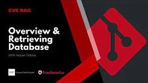
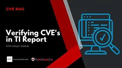
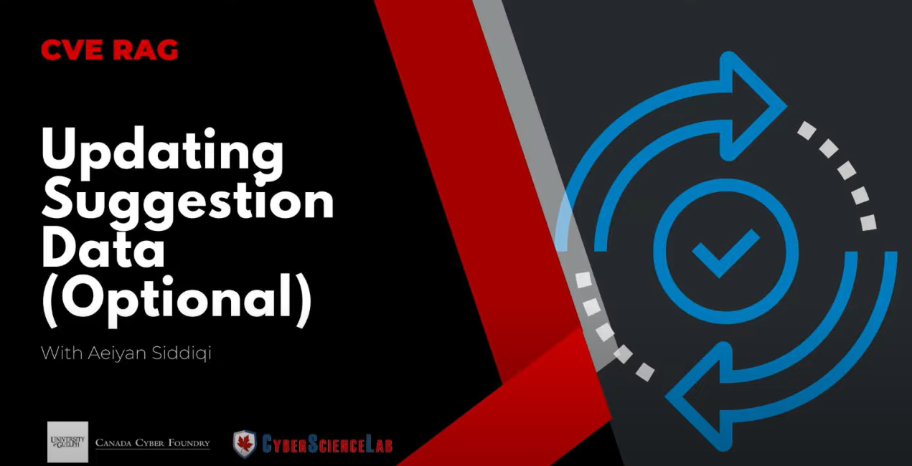

# RAG_LLM_CVE
 Developing RAG to address LLM hallucinations in SOCs

## Overview

This project implements a Retrieval-Augmented Generation (RAG) model designed to validate the use of Common Vulnerabilities and Exposures (CVEs) in security reports. The system leverages Metas' Llama3 to ensure that CVEs are accurately referenced and used in context within threat intelligence reports.

## Documentation

The following document goes into deeper detail on how to run the application, update the database, and how the program works:

- [CVE Document](assets/CVE%20Document.pdf)

## Features

- **CVE Retrieval:** Retrieves relevant CVE information from a database or API.
- **Contextual Validation:** Validates that CVEs are used correctly in the context of security reports.
- **Report Integration:** Integrates with security reports to provide feedback on CVE usage.
- **Recommendation CVE:** Give a recommendation of a similar CVE that does not exist the database. 

## Requirements (have to update)

- **Python 3.10**
- **Accelerate**
- **Bitsandbytes**
- **Langchain**
- **Sentence-transformers**
- **Transformers**
- **Tqdm**
- **pytorch**      
- **tokenizers**   
- **torchaudio**               
- **Torchvision**
- **Huggingface_hub**
- **Pandas**

## Video Playlist

For a more interactive learning experience, check out our YouTube videos:

1. **[How to Use Our Malware CVE Rag - Overview and Retrieving Database](https://youtu.be/8v7BxJ0Glio?si=tkFuZnWctCKI3Io6)**
   - 

2. **[How to Use Our Malware CVE Rag - Overview and Retrieving Database](https://www.youtube.com/watch?v=AWQRVPhzMJA)**
   - 

3. **[How to Use Our Malware CVE Rag - Overview and Retrieving Database](https://www.youtube.com/watch?v=0aDswPXfcnI)**
   - 

4. **[How to Use Our Malware CVE Rag - Overview and Retrieving Database](https://www.youtube.com/watch?v=0aDswPXfcnI)**
   - 
